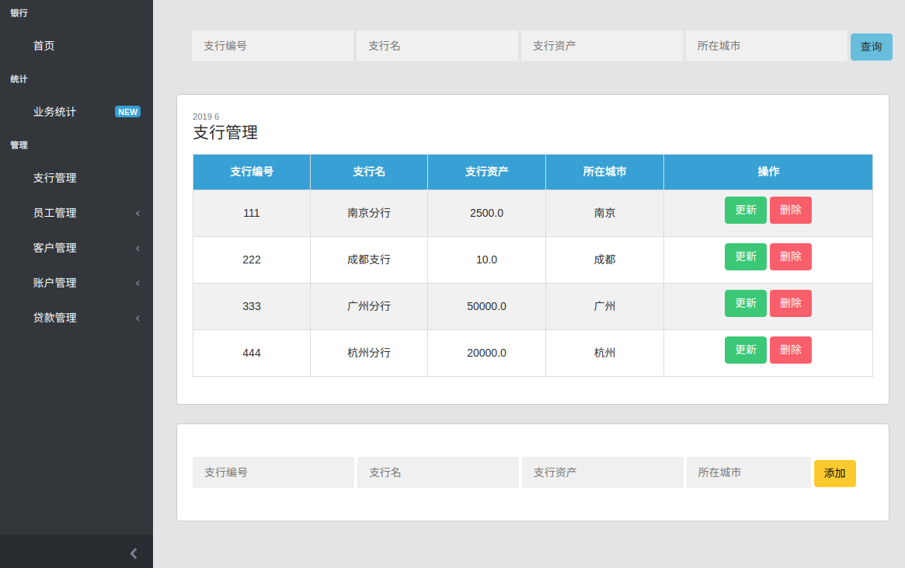

# SE-BankSys
Bank system project
Based on Flask and MySQL

## 前端

### 逻辑

前端使用了Boostrap模板 [CoreUI](https://coreui.io/), 分为管理和统计两个功能模块。

**管理模块**

管理模块共有五个子模块：支行管理，员工管理，客户管理，账户管理和贷款管理。

每一个管理模块分为三个板块：

* 最上方是查询板块，提供针对所有信息的搜索（可以叠加搜索条件）。
* 第二个板块是信息展示板块，在没有指定搜索目标时展示的是数据库中的所有条目。每一个条目提供更新和删除服务（见后图）。
* 第三个板块是添加服务，可向数据库增添新条目。

**统计模块**

 

按照业务分类和统计对象（金额，用户）分为六个饼状图：

- 储蓄存款，储蓄取款，储蓄总金额，储蓄用户数；
- 贷款总金额，贷款用户数；

使用饼状图的目的是展示各支行的业务相对情况，鼠标移动到图像上时会显示具体数字。

