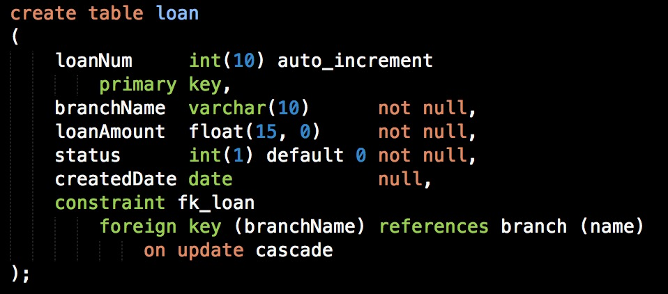
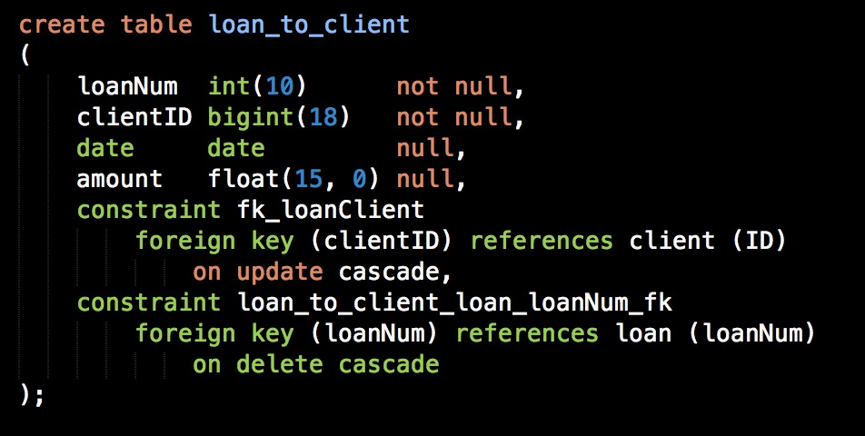
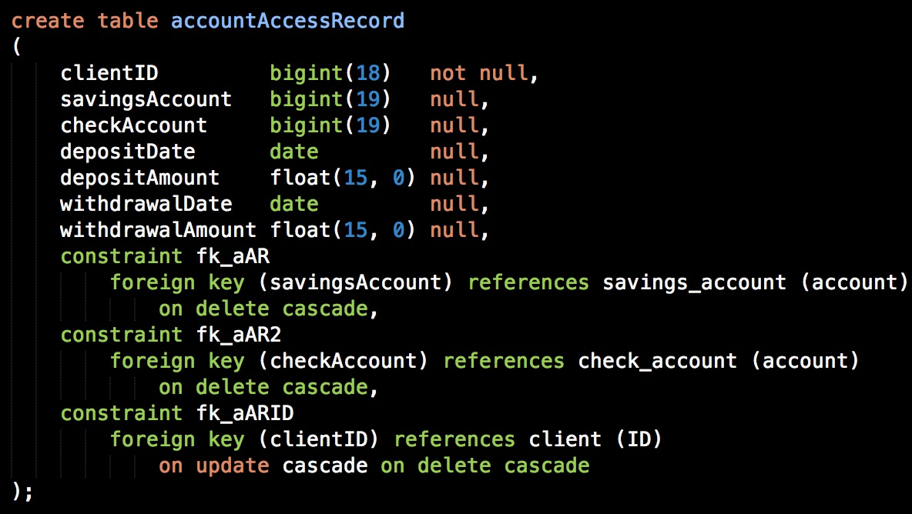

# 银行业务系统管理实验报告——数据库模块

1. 系统目标

   本系统旨在开发一套轻量级的银行业务管理系统，能够实现银行的基本管理功能。

2. 需求说明

* 支行管理：提供支行所有信息的增、删、改、查功能；如果支行存在着关联信息，如员工、账户等，则不允许删除；

* 员工管理：提供支行员工所有信息的增、删、改、查功能；如果员工存在着关联数据，则不允许删除；

* 客户管理：提供客户所有信息的增、删、改、查功能；如果客户存在着关联账户或贷款记录，则不允许删除；

* 账户管理：提供账户开户、销户、修改、查询功能，包括储蓄账户和支票账户；账号不允许修改；

* 贷款管理：提供贷款信息的增、删、查功能，提供贷款发放功能；贷款信息一旦添成功后不允许修改；要求能查询每笔贷款的当前状态（未开始发放、发放中、已全部发放）；处于发放中状态的贷款记录不允许删除；

3. 数据库ER图及表设计

   **ER图**

   

   **基本表**

   支行表

   

   员工表

   

   部门表

   

   客户表

   

   储蓄账户

   

   支票账户

   

   贷款表

   

   客户，支行，账户关系表

   

   

   贷款给客户表

   

   客户联系人表

   

   账户存取记录表

   

   支行管理员工表

   

4. 详细设计

   * 存储过程设计

     * 业务统计部分

       * cxckmonth(in ye int, in mon int, in branch varchar(15), out money float, out number int )
       * cxckseason(in ye int, in se int, in branch varchar(15), out money float, out number int)
       * cxckyear(in ye int, in branch varchar(15), out money float, out number int) 
       * cxqkmonth(in ye int, in mon int, in branch varchar(15),out money float, out number int) 
       * cxqkseason(in ye int, in se int, in branch varchar(15),out money float, out number int )
       * cxqkyear(in ye int, in branch varchar(15),out money float, out number int ) 
       * dkmonth(in ye int, in mon int, in branch varchar(15), out money float, out number int)
       * dkseason(in ye int, in se int, in branch varchar(15), out money float, out number int) 
       * dkyear(in ye int, in branch varchar(15), out money float, out number int)
       * cxmonthNum(in ye int,in month int,in branchNum int,out number int)
       * cxseasonNum(in ye int,in month int,in branchNum int,out number int)
       * cxyearNum(in ye int,in month int,in branchNum int,out number int)

       以cxckmonth( )为例，表示按月的储蓄存款，输入年份，月，支行名到ye, mon, branch，输出money, number表示业务总金额和用户总人数。

       cxmonthNum( )统计的是指定月份内指定支行的用户数。

       dkmonth( )统计的是指定月份内指定银行的贷款总金额和用户数。

     * 贷款状态修改

       * dkstatus(in dknum char(10))

       输入贷款号，根据贷款发放记录自动修改loan表里的status。注：每次在loan_to_client表里修改后都要对应的执行一次dkstatus( )存储过程。

   * 存在问题及涉及细节

     * 未在数据库端实现发放中的贷款，账号不允许删除功能，需要在后端实现。
     * 储蓄的业务总金额数分为存款总金额和取款总金额。
     * 贷款业务总金额数按照银行发放贷款的金额统计，用户总人数为贷款发放给用户表里的用户总数。
     * 每个经理只能管理一个部门
     * 支行不能直接查询部门，必须通过员工表连接
     * 利率设置为float类型，不能输入百分号

5. 测试代码

   ```sql
   insert into client_branch_account
   values(832832196704123222,"南京分行","006","666"); --注意006上一定要加双引号，不加双引号插入后会变成6.
   
   select * from client_branch_account;
   
   insert into client_branch_account
   values(832832196704123222,"广州分行",null,"666"); --错误，重复账户名不会报错
   
   delete from client_branch_account
   where clientID = 282901198708214326 and branchName = "新合肥分行"; --报错，存在外键约束
   
   update client_branch_account
   set savingsAccount = "008"
   where savingsAccount = "001";	--报错，因为存在外键约束，不能修改账户号
   
   insert into savingsAccount
   values (4,'2017-04-19',600,'2017-04-19',0.1,"电子现金");
   
   update savingsAccount
   set account = 5
   where account = 4; --SQL可以修改，但实际要求不能修改，需要后端调整
   
   --增加unique约束
   alter table `client_branch_account` add unique(`savingsAccount`);
   alter table `client_branch_account` add unique(`checkAccount`);
   
   insert into branch 
   values("广州分行",50000,"广州");
   
   delete from branch
   where name = "合肥分行"; --报错
   
   delete from branch
   where name = "广州分行";
   
   update branch
   set name = "新合肥分行" 
   where name = "合肥分行";
   
   --调用存储过程
   call dkmonth(2014,6,"合肥分行",@a,@b);
   select @a;
   select @b;
   
   insert into client
   values(13459820000302,33,"客户5",6332333,"2号楼"); --报错，staffID约束
   
   insert into client
   values(13459820000302,329120194802123211,"客户5",6332333,"2号楼");
   
   delete from client
   where ID = 283998196806218831; --报错
   
   update client
   set ID = 283998196806218831
   where ID = 283998196806218832;
   
   select temp.address,ID from (select count(*),address from client group by address)
   as temp, client
   where client.address = temp.address;	--groupby查询不是作为groupby属性的操作,temp为临时表
   
   --删除约束
   select * from information_schema.table_constraints;
   alter table loan drop check loan_to_client_chk_1;
   
   insert into branch 
   values("广州分行",50000,"广州");
   
   delete from branch
   where name = "合肥分行"; --报错,不能删除
   
   delete from branch
   where name = "广州分行";
   
   update branch
   set name = "新合肥分行" 
   where name = "合肥分行";
   
   select * from branch;
   
   insert into loan 
   values("0003","广州分行",10000,0,'2015-08-20');
   
   delete from loan 
   where loanNum = "0001"; --报错，有外键约束
   
   update loan
   set loanNum = "0005"
   where loanNum = "0001";	--报错，不能修改
   
   select QUARTER(`创建日期`) from 贷款
   where year(`创建日期`) = 2014;
   
   insert into sta
   values(632123196710175233,4,"小黄",6230333,235,"员工"); --报错，与部门的外键关系出错,因为部门表没有4号部门
   
   insert into sta
   values(632123196710175233,2,"小黄",6230333,235,"员工");
   
   delete from sta
   where ID = 632123196710175233;
   
   update sta
   set ID = 222222199808102344
   where ID = 632123196710175233;
   
   select departNum,count(*) from sta
   group by departNum;
   
   insert into branch_staff
   values("广州分行",222222199808102344,'2010-10-04');
   
   delete from sta
   where ID = 222222199808102344; --报错，因为存在外键
   
   insert into depart
   values(3,"生产部","生产岗");
   
   insert into sta
   values(333333123232323,3,"dd",3333,22,"dd");
   
   
   delete from depart
   where departNum = 3;
   
   ```

   