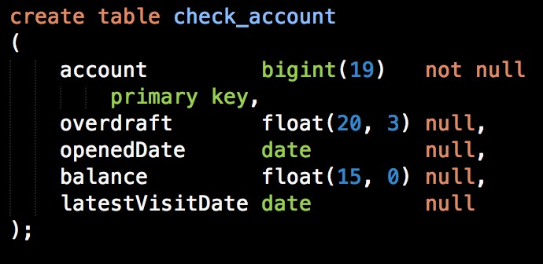
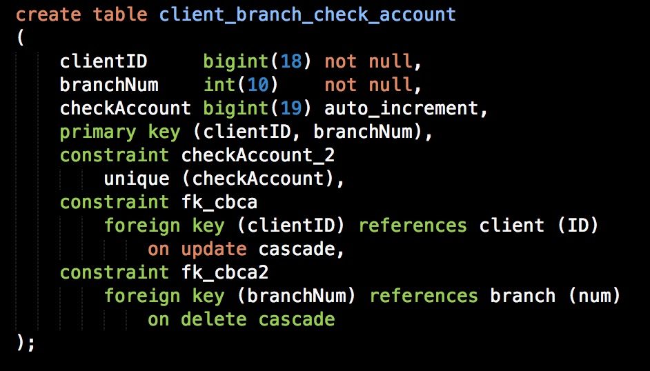
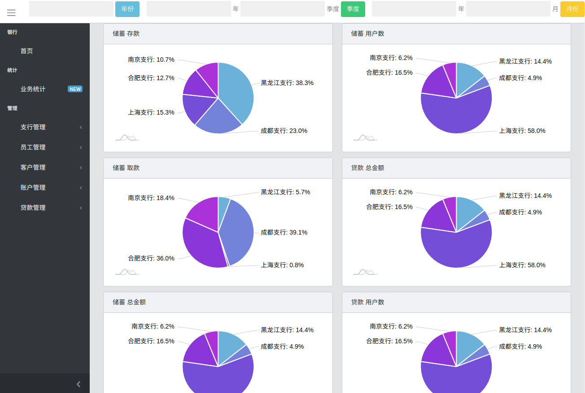
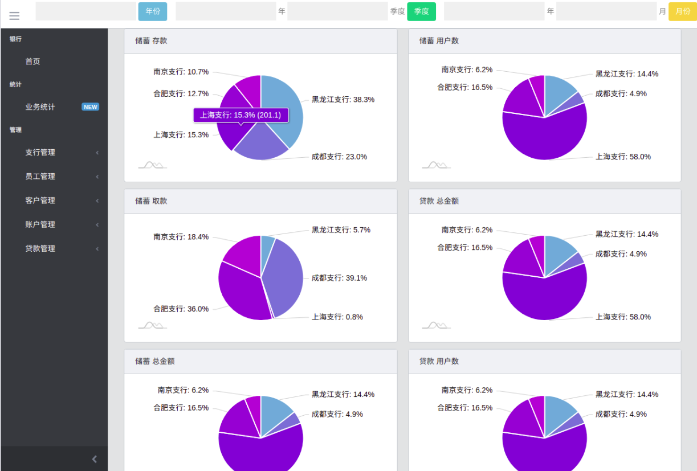

# lab3 实验报告

## 1  概述

### 1.1  系统目标

本系统主要目标为开发一个银行管理系统，采用 B/S 架构，主要数据库操作部分均在服务器上完成，具体设计细节见后续说明。

### 1.2  需求说明

#### 1.2.1 数据需求

银行有多个支行。各个支行位于某个城市，每个支行有唯一的名字。银行要监控每个支行的资产。 银行的客户通过其身份证号来标识。银行存储每个客户的姓名、联系电话以及家庭住址。为了安全起见，银行还要求客户提供一位联系人的信息，包括联系人姓名、手机号、 Email 以及与客户的关系。客户可以有帐户，并且可以贷款。客户可能和某个银行员工发生联系，该员工是此客户的贷款负责人或银行帐户负责人。银行员工也通过身份证号来标识。员工分为部门经理和普通员工，每个部门经理都负责领导其所在部门的员工，并且每个员工只允许在一个部门内工作。每个支行的管理机构存储每个员工的姓名、电话号码、家庭地址及部门经理的身份证号。银行还需知道每个员工开始工作的日期，由此日期可以推知员工的雇佣期。银行提供两类帐户——储蓄帐户和支票帐户。帐户可以由多个客户所共有，一个客户也可开设多个账户，但在一个支行内最多只能开设一个储蓄账户和一个支票账户。每个帐户被赋以唯一的帐户号。银行记录每个帐户的余额、开户日期、开户的支行名以及每个帐户所有者访问该帐户的最近日期。另外，每个储蓄帐户有利率和货币类型，且每个支票帐户有透支额。 每笔贷款由某个分支机构发放，能被一个或多个客户所共有。每笔贷款用唯一的贷款号标识。银行需要知道每笔贷款所贷金额以及逐次支付的情况（银行将贷款分几次付给客户）。 虽然贷款号不能唯一标识银行所有为贷款所付的款项，但可以唯一标识为某贷款所付的款项。 对每次的付款需要记录日期和金额。

#### 1.2.2 功能需求

- 支行管理：提供支行所有信息的增、删、改、查功能；如果支行存在着关联信息，如员工、账户等，则不允许删除；
- 员工管理：提供支行员工所有信息的增、删、改、查功能；如果员工存在着关联数据， 则不允许删除；
- 客户管理：提供客户所有信息的增、删、改、查功能；如果客户存在着关联账户或者贷款记录，则不允许删除；
- 账户管理：提供账户开户、销户、修改、查询功能，包括储蓄账户和支票账户；账户号不允许修改；
- 贷款管理：提供贷款信息的增、删、查功能，提供贷款发放功能；贷款信息一旦添加成功后不允许修改；要求能查询每笔贷款的当前状态（未开始发放、发放中、已全部发放）；处于发放中状态的贷款记录不允许删除；
- 业务统计：按业务分类（储蓄、贷款）和时间（月、季、年）统计各个支行的业务总金额和用户数（选做：对统计结果以饼图或曲线图显示）。

### 1.3  本报告的主要贡献

本报告主要根据需求提供相应的体系架构设计，根据具体实现细节提供相关功能的说明，并展示最终项目效果。

## 2  总体设计


### 2.1  系统模块结构


- Web 前端部分实现用户交互界面，提供相关操作接口；
- 服务端处理前端的操作请求，与数据库进行交互，实现下述子模块的功能：
  - 支行管理模块：实现对支行信息的增删改查；
  - 员工管理模块：实现对员工信息的增删改查；
  - 客户管理模块：实现对客户信息的增删改查；
  - 账户管理模块：实现对账户信息的增删改查，包括贷款账户和储蓄账户，以及存取款记录功能；
  - 贷款管理模块：实现对贷款信息的增删改查，包括发放贷款，以及贷款状态的修改。
- 数据库模块提供了上述信息的存储结构，并且通过存储过程，实现在数据库部分的业务统计功能。

### 2.2  系统工作流程


### 2.3  数据库设计

**ER图**

 

**基本表**

支行表


员工表


部门表


客户表


储蓄账户


支票账户



贷款表


客户，支行，账户关系表




贷款给客户表


客户联系人表


账户存取记录表


支行管理员工表


## 3  详细设计

因为整体采用 Flask 框架，通过 flask-sqlalchemy 包进行对数据库的操作，所以下面模块的设计均为在 `app.py` 中的函数。前端部分因为主要为静态网页，通过 Flask 框架进行信息的传输，所以就不再进行详细的赘述。

### 3.1 支行管理模块

具体设计如下：

```python
@app.route('/branch', methods=['GET', 'POST'])
def branch():
    labels = ['支行编号', '支行名', '支行资产', '所在城市']
    result_query = db.session.query(Branch)
    result = result_query.all()
    if request.method == 'GET':
        return render_template('branch.html', labels=labels, content=result)
    else:
        if request.form.get('type') == 'query':
            branch_num = request.form.get('branchNum')
            branch_name = request.form.get('name')
            branch_asset = request.form.get('estate')
            branch_city = request.form.get('city')

            if branch_num != "":
                result_query = result_query.filter(Branch.num == branch_num)
            if branch_name != "":
                result_query = result_query.filter(Branch.name == branch_name)
            if branch_asset != "":
                result_query = result_query.filter(Branch.assets == branch_asset)
            if branch_city != "":
                result_query = result_query.filter(Branch.city == branch_city)
            
            result = result_query.all()

            return render_template('branch.html', labels=labels, content=result)
            
        elif request.form.get('type') == 'update':
            old_num = request.form.get('key')
            branch_name = request.form.get('branch_name')
            branch_asset = request.form.get('branch_asset')
            branch_city = request.form.get('branch_city')
            branch_result = db.session.query(
                Branch).filter_by(num=old_num).first()
            branch_result.name = branch_name
            branch_result.assets = branch_asset
            branch_result.city = branch_city
            db.session.commit()

        elif request.form.get('type') == 'delete':
            old_num = request.form.get('key')
            branch_result = db.session.query(
                Branch).filter_by(num=old_num).first()
            db.session.delete(branch_result)
            db.session.commit()

        elif request.form.get('type') == 'insert':
            branch_name = request.form.get('name')
            branch_asset = request.form.get('estate')
```

首先从数据库中查询到所有的数据，并进行返回在页面进行渲染，得到进入主页的全部信息的显示部分。

之后根据前端页面发送的 POST 请求，读取其中 form 的信息，再根据 form 中 type 类的类型，进行相应的增删改查功能的操作，其中删改查均要根据相关信息现在数据库中进行查询，得到结果之后进行下一步的操作。

因为每一个模块的大体设计相同，所以后面的模块就仅对不同部分进行说明，具体设计可以见源代码。

### 3.2 员工管理模块

具体设计如下：

```python
@app.route('/staff', methods=['GET', 'POST'])
def staff():
    labels = ['员工ID', '所在支行', '部门号', '员工姓名', '员工电话', '员工地址', '员工职位', '雇佣日期']
    result_query = db.session.query(Sta, BranchStaff).filter(Sta.ID == BranchStaff.staffID)
    result = result_query.all()

    if request.method == 'GET':
        return render_template('staff.html', labels=labels, content=result)
    else:
        if request.form.get('type') == 'query':
				'''...'''
        elif request.form.get('type') == 'update':
				'''...'''
        elif request.form.get('type') == 'delete':
        '''...'''
        elif request.form.get('type') == 'insert':
            ID = request.form.get('staffID')
            branch = request.form.get('branch')
            departNum = request.form.get('departNum')
            name = request.form.get('name')
            phone = request.form.get('phone')
            address = request.form.get('address')
            position = request.form.get('position')
            date = request.form.get('date')

            date = date.split('-')
            date = datetime.date(
                int(date[0]), int(date[1]), int(date[2]))

            newStaff = Sta(
                ID = ID,
                departNum = departNum,
                name = name,
                telephone = phone,
                address = address,
                position = position
            )

            newStaffBranch = BranchStaff(
                branchName = branch,
                staffID = ID,
                employDate = date
            )

            db.session.add(newStaff)
            db.session.add(newStaffBranch)
            db.session.commit()
```

前面部分与基本相同，在添加新条目时需要同时对支行管理客户表进行添加。

### 3.3 客户管理模块

该模块设计与前述模块设计相类似，同样是在添加新条目的时候要对客户联系人进行同步添加。

### 3.4 账户管理模块

账户管理部分具体设计如下：

```python
@app.route('/account', methods=['GET', 'POST'])
def account():
    '''...'''
    if request.method == 'GET':
        return render_template('account.html', labels1=labels1, labels2=labels2, content1=content1, content2=content2)
    else:
        if request.form.get('type') == 'squery':
            '''...'''
            return render_template('account.html', labels1=labels1, labels2=labels2, content1=content1, content2=content2)

        elif request.form.get('type') == 'cquery':
            '''...'''
            return render_template('account.html', labels1=labels1, labels2=labels2, content1=content1, content2=content2)

        elif request.form.get('type') == 'addAcc':
            clientID = request.form.get('clientID')
            clientName = request.form.get('clientName')
            branchNum = request.form.get('branch')
            openDate = request.form.get('openDate')
            balance = request.form.get('balance')
            accType = request.form.get('accType')
            interestRate = request.form.get('interest')
            currType = request.form.get('currType')
            overDraft = request.form.get('overDraft')

            openDate = openDate.split('-')
            openDate = datetime.date(
                int(openDate[0]), int(openDate[1]), int(openDate[2]))

            if accType == 'saving':
                # client_branch_account 表中存储账户和支票账户是否存在检查
                newClientBranch = ClientBranchSavingsAccount(
                    clientID=clientID,
                    branchNum=branchNum
                )
            else:
                newClientBranch = ClientBranchCheckAccount(
                    clientID=clientID,
                    branchNum=branchNum
                )
            db.session.add(newClientBranch)
            db.session.commit()

            if accType == 'saving':
                newAccount = SavingsAccount(
                    openedDate=openDate,
                    balance=balance,
                    latestVisitDate=openDate,
                    interestRate=interestRate,
                    currencyType=currType
                )
                newAccount.account = newClientBranch.savingsAccount

            else:
                newAccount = CheckAccount(
                    openedDate=openDate,
                    balance=balance,
                    latestVisitDate=openDate,
                    overdraft=overDraft
                )
                newAccount.account = newClientBranch.checkAccount

            db.session.add(newAccount)
            db.session.commit()

        elif request.form.get('type') == 'supdate':
            '''...'''

        elif request.form.get('type') == 'cupdate':
            '''...'''

        elif request.form.get('type') == 'delete':
            '''...'''
            
    return render_template('account.html', labels1=labels1, labels2=labels2, content1=content1, content2=content2)
```

因为账户分为储蓄账户和贷款账户，所以在账户管理模块要对相应的操作进行区分。而在添加账户的时候，要在客户账户表中进行重复检查，之后根据所要添加的账户类型进行添加。

### 3.5 贷款管理模块

```python
@app.route('/debt', methods=['GET', 'POST'])
def debt():

    if request.method == 'GET':
        return render_template('debt.html', labels=labels, labels2=labels2, content=content, content2=result)
    else:
        if request.form.get('type') == 'main_query':
            '''...'''

        elif request.form.get('type') == 'update':
            '''...'''

        elif request.form.get('type') == 'delete':
            '''...'''

        elif request.form.get('type') == 'insert':
            '''...'''
        
        elif request.form.get('type') == 'query':
            '''...'''

        elif request.form.get('type') == 'give':
            loanNum = request.form.get('loanNum')
            clientID = request.form.get('clientID')
            date = request.form.get('date')
            money = request.form.get('money')

            date = date.split('-')
            date = datetime.date(
                int(date[0]), int(date[1]), int(date[2]))

            ins = t_loan_to_client.insert()
            db.session.execute(db.insert(t_loan_to_client, values={'loanNum': loanNum, 'clientID': clientID, 'date': date, 'amount': money}))
            db.session.commit()
            cursor.callproc('dkstatus', (loanNum,))
            db2.commit()

    content = db.session.query(Loan).all()

    return render_template('debt.html', labels=labels, content=content, labels2=labels2, content2=result)
```

该模块中需要提供发放贷款的功能，即一笔贷款，可以发放多次，每一次发放都要对贷款客户表进行插入更新，并且调用数据库中的存储过程进行状态更新。

### 3.6 业务统计模块

具体设计如下：

```python
@app.route('/statistics', methods=['GET', 'POST'])
def statistics():
    bank_list = [['合肥', 100, 100, 100], ['成都', 250, 250, 250], ['杭州', 300, 300, 300], ['南京', 120, 120, 120]]

    bank_all = db.session.query(Branch).all()
    new_bank_list = []
    for i in bank_all:
        new_bank_list.append([i.num, i.name])

    if request.method == 'GET':
        return render_template('statistics.html', bank_list=bank_list)
    else:
        '''
            i[0]: 支行号
            i[1]: 支行名
            i[2]: 储蓄存款
            i[3]: 储蓄取款
            i[4]: 贷款总金额
            i[5]: 储蓄总人数
            i[6]: 贷款总人数
        '''
        if request.form.get('type') == 'year':
            year = request.form.get('year')
            for i in new_bank_list:
                cxck = cursor.callproc('cxckyear', (int(year), i[0], None, None))
                cxqk = cursor.callproc('cxqkyear', (int(year), i[0], None, None))
                dk = cursor.callproc('dkyear', (int(year), i[1], None, None))
                num = cursor.callproc('cxyearNum', (int(year), i[0], None))
                i.append(cxck[2])   # i[2]
                i.append(cxqk[2])   # i[3]
                i.append(dk[2])     # i[4]
                i.append(num[2])    # i[5]
                i.append(dk[3])     # i[6]

            #return str(new_bank_list)
        elif request.form.get('type') == 'season':
            year = request.form.get('year')
            season = request.form.get('season')
            for i in new_bank_list:
                cxck = cursor.callproc('cxckseason', (int(year), int(season), i[0], None, None))
                cxqk = cursor.callproc('cxqkseason', (int(year), int(season), i[0], None, None))
                dk = cursor.callproc('dkseason', (int(year), int(season), i[1], None, None))
                num = cursor.callproc('cxseasonNum', (int(year), int(season), i[0], None))
                i.append(cxck[3])   # i[2]
                i.append(cxqk[3])   # i[3]
                i.append(dk[3])     # i[4]
                i.append(num[3])    # i[5]
                i.append(dk[4])     # i[6])
            
        elif request.form.get('type') == 'month':
            year = request.form.get('year')
            month = request.form.get('month')
            for i in new_bank_list:
                cxck = cursor.callproc('cxckmonth', (int(year), int(month), i[0], None, None))
                cxqk = cursor.callproc('cxqkmonth', (int(year), int(month), i[0], None, None))
                dk = cursor.callproc('dkmonth', (int(year), int(month), i[1], None, None))
                num = cursor.callproc('cxmonthNum', (int(year), int(month), i[0], None))
                i.append(cxck[3])   # i[2]
                i.append(cxqk[3])   # i[3]
                i.append(dk[3])     # i[4]
                i.append(num[3])    # i[5]
                i.append(dk[4])     # i[6]

    
    
    #bank_list = [['合肥', 100], ['成都', 250], ['杭州', 300], ['南京', 120]]
    bank_list = new_bank_list
    #return str(bank_list)
    return render_template('statistics.html', bank_list=bank_list)
```

本模块进行对存储过程的调用，根据调用得到的结果，在前端页面进行渲染，得到饼状图。

具体的存储过程设计如下：

- 存储过程设计

  - 业务统计部分

    - cxckmonth(in ye int, in mon int, in branch varchar(15), out money float, out number int )
    - cxckseason(in ye int, in se int, in branch varchar(15), out money float, out number int)
    - cxckyear(in ye int, in branch varchar(15), out money float, out number int) 
    - cxqkmonth(in ye int, in mon int, in branch varchar(15),out money float, out number int) 
    - cxqkseason(in ye int, in se int, in branch varchar(15),out money float, out number int )
    - cxqkyear(in ye int, in branch varchar(15),out money float, out number int ) 
    - dkmonth(in ye int, in mon int, in branch varchar(15), out money float, out number int)
    - dkseason(in ye int, in se int, in branch varchar(15), out money float, out number int) 
    - dkyear(in ye int, in branch varchar(15), out money float, out number int)
    - cxmonthNum(in ye int,in month int,in branchNum int,out number int)
    - cxseasonNum(in ye int,in month int,in branchNum int,out number int)
    - cxyearNum(in ye int,in month int,in branchNum int,out number int)

    以cxckmonth( )为例，表示按月的储蓄存款，输入年份，月，支行名到ye, mon, branch，输出money, number表示业务总金额和用户总人数。

    cxmonthNum( )统计的是指定月份内指定支行的用户数。

    dkmonth( )统计的是指定月份内指定银行的贷款总金额和用户数。

  - 贷款状态修改

    - dkstatus(in dknum char(10))

    输入贷款号，根据贷款发放记录自动修改loan表里的status。注：每次在loan_to_client表里修改后都要对应的执行一次dkstatus( )存储过程。

- 存在问题及涉及细节

  - 未在数据库端实现发放中的贷款，账号不允许删除功能，需要在后端实现。
  - 储蓄的业务总金额数分为存款总金额和取款总金额。
  - 贷款业务总金额数按照银行发放贷款的金额统计，用户总人数为贷款发放给用户表里的用户总数。
  - 每个经理只能管理一个部门
  - 支行不能直接查询部门，必须通过员工表连接
  - 利率设置为float类型，不能输入百分号

## 4  实现与测试

### 逻辑

前端使用了Bootstrap模板 [CoreUI](https://coreui.io/), 分为管理和统计两个功能模块。

**管理模块**

管理模块共有五个子模块：支行管理，员工管理，客户管理，账户管理和贷款管理。


每一个管理模块分为三个板块：

- 最上方是查询板块，提供针对所有信息的搜索（可以叠加搜索条件）。
- 第二个板块是信息展示板块，在没有指定搜索目标时展示的是数据库中的所有条目。每一个条目提供更新和删除服务（见后图）。
- 第三个板块是添加服务，可向数据库增添新条目。


*图片：点击“更新”操作*


图片：点击“删除”操作


**统计模块**

 

按照业务分类和统计对象（金额，用户）分为六个饼状图：

- 储蓄存款，储蓄取款，储蓄总金额，储蓄用户数；
- 贷款总金额，贷款用户数；

使用饼状图的目的是展示各支行的业务相对情况，鼠标移动到图像上时会显示具体数字。


### 4.2  测试结果

五个模块的基本功能都是增删改查，仅以支行管理为例，展示增删改查的操作界面和返回结果。最后附上几个错误插入的示例。

- 支行管理

  原状态

  

  增加南京分行

  

  

  修改南京分行

  

  

  删除南京分行——点击删除按钮，下图为删除后结果

  

  查询支行编号为2的银行

  

  

- 员工管理

  初始页面

  

- 客户管理

  初始页面

  

- 账户管理

  初始页面

  

- 贷款管理

  初始页面

  

- 业务统计

  初始状态：


​	示例结果：



​	细节展示：



- 错误展示

  插入一个支行编号不错在的员工

  

  结果显示

  

  删除有关联信息的支行

  

  有关联信息，所以无法删除

  

## 5  总结与讨论

通过开发一个简易但完整的银行系统，我们有了对数据库工程开发的初步了解，也对数据库的python包 (flask, flask-sqlalchemy, flask-sqlacodegen, numpy, mysql-connector, pymysql)有了使用经验。从后端的这个实验不仅让我们了解巩固数据库知识，也对软件工程以及测试有了新的认识。

我们团队合作完成这个实验，它也培养了我们团队分工合作的能力。

## 附录  团队介绍与工作分工

- 张立夫，PB15020718：
  - 系统整体架构设计；
  - 服务端编写；
  - 前后端、后端数据库对接处理；
  - 编写实验报告主体部分；
- 张衎，PB15021071：
  - 数据库结构设计与实现；
  - 存储过程设计；
  - 参与后端与数据库对接处理；
  - 编写实验报告数据库部分；
- 蔡文韬，PB15081576：
  - 前端设计与编写；
  - 参与前后端对接处理；
  - 编写实验报告结果部分；

 

